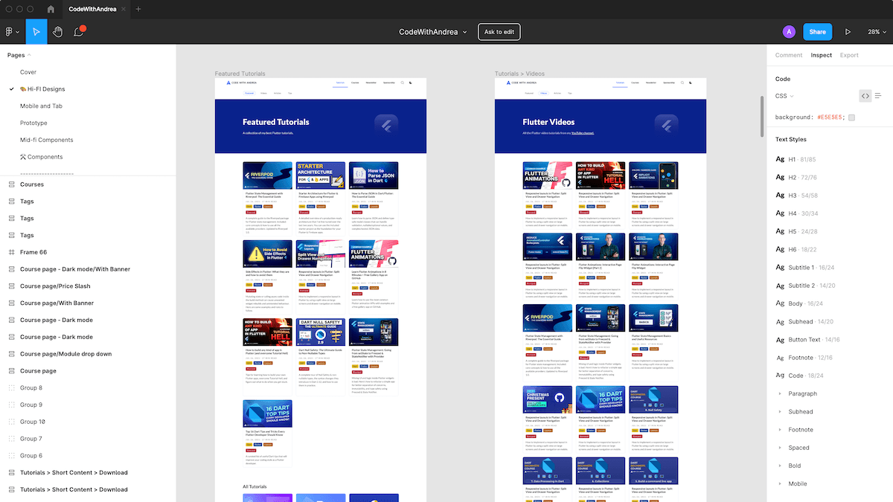
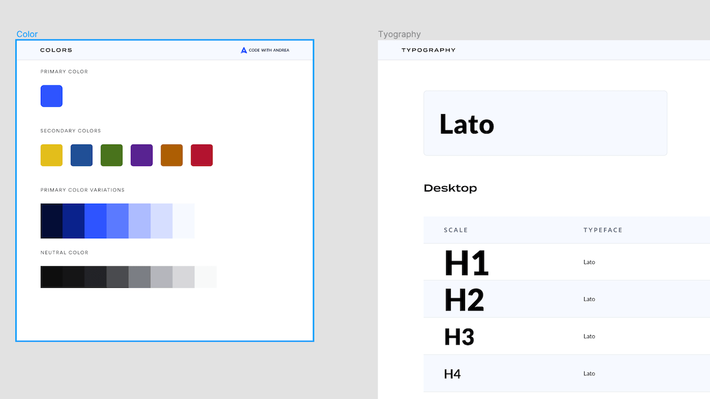

# App Development workflow in 6 steps

When building non-trivial apps, following a *structured workflow* can bring great benefits and avoid many pitfalls.

Rather than diving straight into the code, here's a 6 step workflow that you can follow.

Thread. 🧵

---

1. Design your app (part 1)

Design all the screens that will be in your app.

You can use Sketch, Figma, Adobe XD, or even draw them by hand.

This will help you think about the most logical UI flows before diving into the code.

Here's an example from my website: 👇

---

1. Design your app (part 2)

This is also a great chance to define stylesheets including a color palette, typography, paddings etc.

This will:

- make your designs much more consistent
- make your app look much nicer
- save you time down the line

---

2. Design your Database/Backend

- what entities do you need? what are their properties & relationships?
- what queries will you need to perform to get the data you need in your UI?
- any other features? Authentication? Data syncing? Realtime updates?

Then, choose your backend.

---

3. Choose the right app architecture

- Is your app UI heavy?
- Is it data-heavy?
- Does it need to connect to device-specific APIs?
- How should data propagate to the UI?
- How should events modify the application state/database?

Continued. 👇

---

3. Choose the right app architecture (part 2)

Answering the questions above will help you choose:

- the most suitable architecture
- the correct state management solution to support your codebase as it grows

There are many choices. Here's one: 👇

[Flutter App Architecture: The Repository Pattern](https://codewithandrea.com/articles/flutter-repository-pattern/)

---

4. Setup a project board and create tasks on GitHub

- Create issues describing each feature you want to build.
- For each task, create a TODO checklist of the things that need to be completed before it's considered done
- This is also a great place to identify dependencies

---

5. Setup a CI workflow

You can use GitHub actions, Codemagic, whatever.

What matters is that you have your automated tests running every time you push a new PR (you do write tests, right?)

---

6. Do the work

- Create a new branch in Git
- Do the work following the steps in the TODO
- Add tests covering edge cases for the feature
- Push a PR to GitHub, and review your own code
- Once everything is green, merge and move on to the next task

https://docs.github.com/en/get-started/quickstart/github-flow

---

What are the benefits of this approach?

- you'll have a consistent design across the entire app
- you'll break your project into a *discrete* set of tasks, each with its own PR, tests, and a clear beginning and end
- you'll have a historical track record about all your changes

---

Of course, there is much more to app development than just this.

But this is already much better than "dive right in, commit everyhing to main, YOLO".

You can benefit from this approach even if you don't work in a team.

It helps you stay organized and see tangible progress.

---

Would you like me to write more about this and create an article?

Let me know in the comments.

If you liked this, retweet the thread above. 👆

And for more Flutter tips, just follow me: [@biz84](https://twitter.com/biz84)

Happy coding!

### Found this useful? Show some love and share the [original tweet](https://twitter.com/biz84/status/1484554041170571264) 🙏