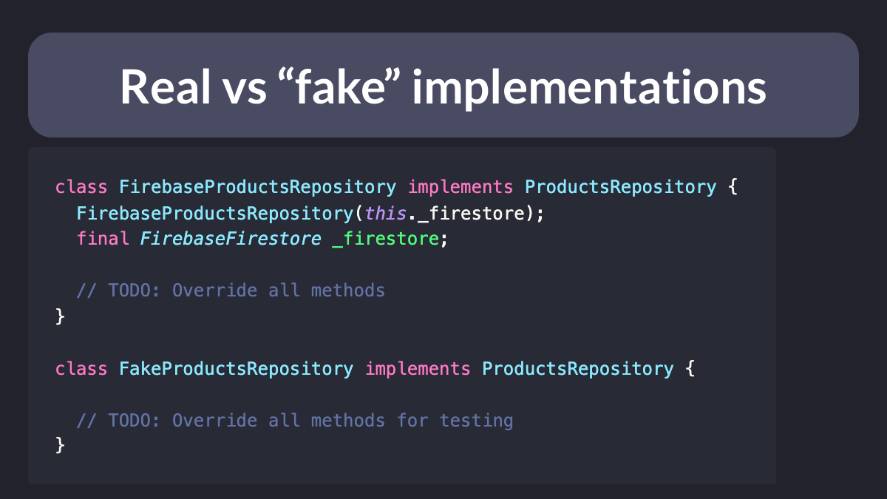

# Repositories as abstract classes (program to interfaces, not implementations)

"Program to interfaces, not implementations" is a very important concept in software design.

It is used to decouple your code from implementation-specific details.

A good use case for this is when creating repositories that connect to external data sources:

---

Once you have an interface (abstract class), you can *implement* it with a concrete implementation.

You can even create a "fake", which can be very useful in your tests.

---

During app startup, you can initialize your repository with a *concrete* instance (using a service locator or any other dependency injection system).

And the rest of your app can just access the repository using the base abstract class.

---

What are the benefits?

- You can swap your real repository with a completely different implementation - the rest of your code doesn't change at all
- You can mock the repository in your tests, so that they run faster and more reliably

Follow me for more tips like this: [@biz84](https://twitter.com/biz84)

### Found this useful? Show some love and share the [original tweet](https://twitter.com/biz84/status/1479432874235514881) 🙏

### Also published on codewithandrea.com 👇

- [Repositories as abstract classes (program to interfaces, not implementations)](https://codewithandrea.com/articles/flutter-repository-pattern/)