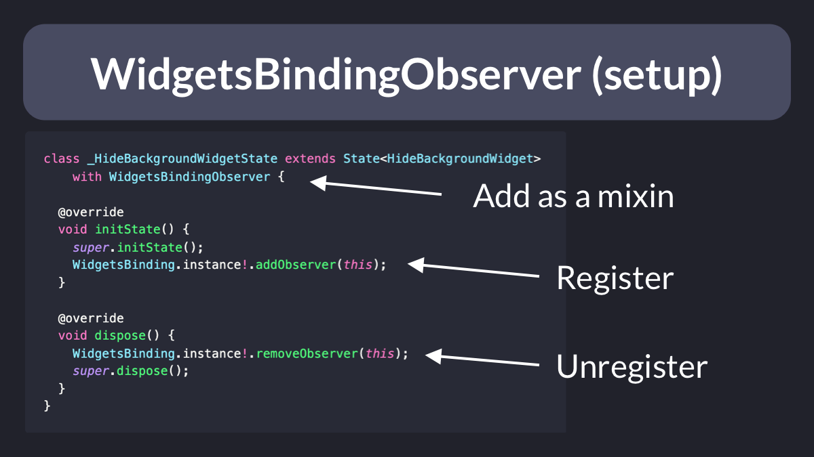
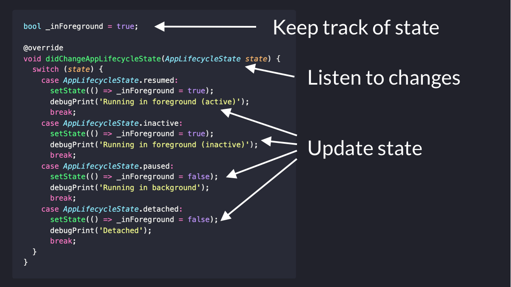
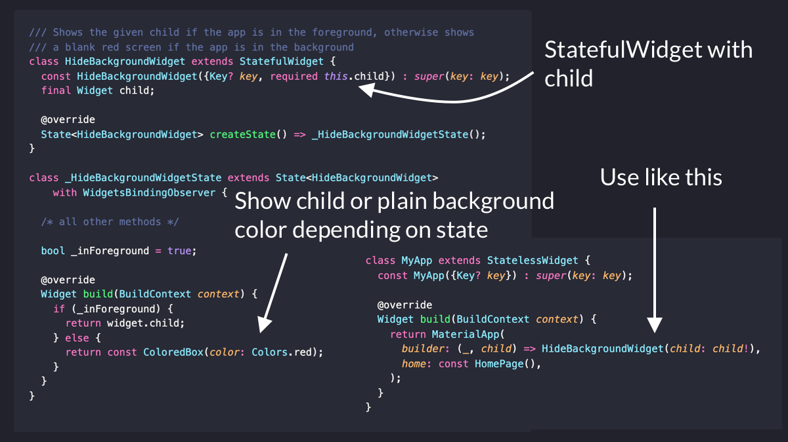

# How to use WidgetsBindingObserver

WidgetsBindingObserver is very handy for listening to changes to:

- routing events
- device orientation
- platform settings (text scale factor, brightness, locale, etc.)
- app lifecycle events

Here's how to use it to hide sensitive info when the app goes to the background. 🧵

----

How to set it up?

- add the WidgetsBindingObserver *mixin* to one of your classes (generally a State subclass)
- register the observer inside initState (and dispose it when done)

----

Then, just override the methods for the changes you want to keep track of.

In this case, we listen to app lifecycle changes and update a "foreground" flag via setState().

------

One useful application of this is to build a custom widget that hides sensitive user data any time the app is backgrounded.

This can be hooked up to the "builder" argument of MaterialApp.

---- 

That's it! You can now test this and check the logs when you background & foreground the app.

---

If you wanna learn more about WidgetsBindingObserver, the official documentation is your best friend:

https://api.flutter.dev/flutter/widgets/WidgetsBindingObserver-class.html

And for more Flutter tips, just follow me: [@biz84](https://twitter.com/biz84)

Happy coding!

### Found this useful? Show some love and share the [original tweet](https://twitter.com/biz84/status/1498679218846285824) 🙏